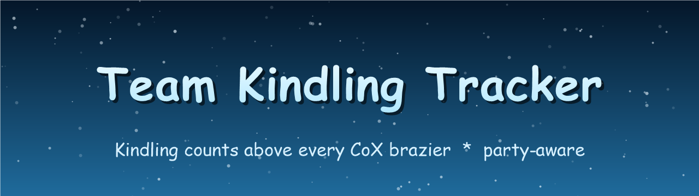

<div align="center">



**Shows how much kindling has been fed into each of the four Ice Demon braziers in the Chambers of Xeric — totalled across your whole party.**

[](https://runelite.net/)
[](https://adoptium.net/temurin/releases/?version=11)
[](LICENSE)
[](https://oldschool.runescape.wiki/w/Ice_demon)

</div>

---

## ✨ Features

| | |
|---|---|
| 🔥 **Count above each brazier** | The party-wide total of kindling fed into each of the four braziers, drawn right above it. |
| 🤝 **Party-aware** | Every member running the plugin shares their additions over the RuneLite Party API; all clients show the same totals. |
| 🎒 **Party inventory overlay** | Optional box listing each member's kindling in inventory — shown during the kindling phase. |
| 🧍 **Counts above heads** | Optional kindling-in-inventory number above each member (adjustable height, font size and bold), shown only during the kindling phase. |
| ♻️ **Auto-reset** | Counts reset when you enter the room / start a new raid, and survive re-logs within the same raid. |

## 🧊 How the brazier counts work

RuneLite only sees **your** client — the game exposes no "fuel level" for the
braziers, and you can't read other players' inventories. So the totals are
**counted, then shared**:

```
You feed a brazier ──▶ your kindling drops ──▶ +N to the nearest brazier
                                                      │
                                            broadcast to the party
                                                      │
        every member's client sums everyone ──▶ total shown above the brazier
```

Because of this, a brazier total is only complete if **everyone contributing is
running the plugin and is in the same RuneLite party**. Members without it still
feed braziers — your client just can't see those additions.

> Detection is **name-based** — the Ice Demon NPC marks the room, braziers are the
> objects named *Brazier* found there, and kindling is items named *Kindling* — so
> there are no hard-coded IDs to break on a game update. Braziers are indexed by their
> instanced world position, which is identical on every client in the raid.

## 🧍 The kindling phase

The above-head numbers and the party box are only useful while you're actually feeding
braziers, so they appear and disappear automatically together:

| Moment | Above-head counts & party box |
|---|---|
| ✅ You reach the Ice Demon room | **Shown** |
| 🔓 The demon thaws / becomes attackable (first hit lands on it) | **Hidden** |
| ☠️ The demon dies / despawns | **Hidden** |

## 🖥️ On screen

```
        12                     7
        ▓▓                    ▓▓        ┌──────────────┐
      [brazier]            [brazier]    │  Kindling    │
                                        │  Zezima   12 │
                  ❄ Ice Demon ❄         │  Woox      7 │
                                        │  B0aty     0 │
      [brazier]            [brazier]    └──────────────┘
        ▓▓                    ▓▓
         5                    9
```

## ⚙️ Configuration

Open the plugin's settings (the gear icon next to it in the plugin list):

| Setting | Default | Description |
|---|---|---|
| **Count above braziers** | On | Draw the party-wide total above each brazier. |
| **Brazier text colour** | Cyan | Colour of that number. |
| **Party inventory overlay** | Off | Show the box listing each member's kindling in inventory. |
| **Inventory count above heads** | Off | Draw each member's kindling-in-inventory count above their head. |
| **Head text colour** | Yellow | Colour of the above-head count. |
| **Head height offset** | 80 | Raise/lower the above-head count (higher moves it up). |
| **Head font size** | 16 | Size of the above-head count. |
| **Head bold text** | On | Render the above-head count in bold. |

## 🚀 Install (Plugin Hub)

Once published, search **"Team Kindling Tracker"** in RuneLite's **Plugin Hub** and
click install. No setup required.

## 🛠️ Build & run from source

You need **JDK 11**. Point `JAVA_HOME` at it and use the Gradle wrapper from the
project root.

<details>
<summary><strong>Windows (PowerShell)</strong></summary>

```powershell
cd C:\path\to\TeamKindlingTracker
$env:JAVA_HOME = "C:\Program Files\Eclipse Adoptium\jdk-11.0.31.11-hotspot\"
.\gradlew.bat run
```
</details>

<details>
<summary><strong>macOS / Linux</strong></summary>

```bash
export JAVA_HOME=/path/to/jdk-11
./gradlew run
```
</details>

| Command | Does |
|---|---|
| `gradlew run` | Launch RuneLite (developer mode) with the plugin loaded. |
| `gradlew build` | Compile and run the unit tests. |
| `gradlew shadowJar` | Build the shaded jar the Plugin Hub publishes. |

### Testing with a second account

The Plugin Hub isn't needed — side-load the plugin on two clients. Run `gradlew run`
twice (the second with its own RuneLite profile, e.g. a Jagex-session-free home for a
legacy account), join both to the same Party passphrase, and they'll share totals.

## 🔍 How it works

- **The Ice Demon room:** detected when the Ice Demon NPC is present (inside a raid).
  Everything keys off this, so braziers in other rooms are ignored.
- **Braziers:** any object named *Brazier* found once you're in the room; tracked by
  instanced world point so they survive scene reloads and index the same on every client.
- **A kindling add:** your inventory kindling dropping while in the room — the amount
  is attributed to the brazier you're standing next to.
- **Sharing:** cumulative per-brazier contributions sent over the Party API, so missed
  messages and late joiners self-heal.
- **Thawed / dead:** the demon's first real hit (now attackable) or its death ends the
  kindling phase and hides the above-head counts and the party box.

## 📦 Publishing to the Plugin Hub

1. Push this project to a **public GitHub repository**.
2. Fork [runelite/plugin-hub](https://github.com/runelite/plugin-hub).
3. Add a file named `plugins/team-kindling-tracker` (no extension) containing:
   ```
   repository=https://github.com/<your-username>/<your-repo>.git
   commit=<full 40-character commit hash you want published>
   ```
4. Open a pull request against `runelite/plugin-hub` and wait for review.

See the [Plugin Hub guide](https://github.com/runelite/plugin-hub) for the full
rules (icon, naming, and review requirements).

## 📜 License

Released under the [BSD 2-Clause License](LICENSE).

Old School RuneScape and the Ice Demon are © Jagex Ltd. This is a fan-made plugin,
not affiliated with or endorsed by Jagex.
